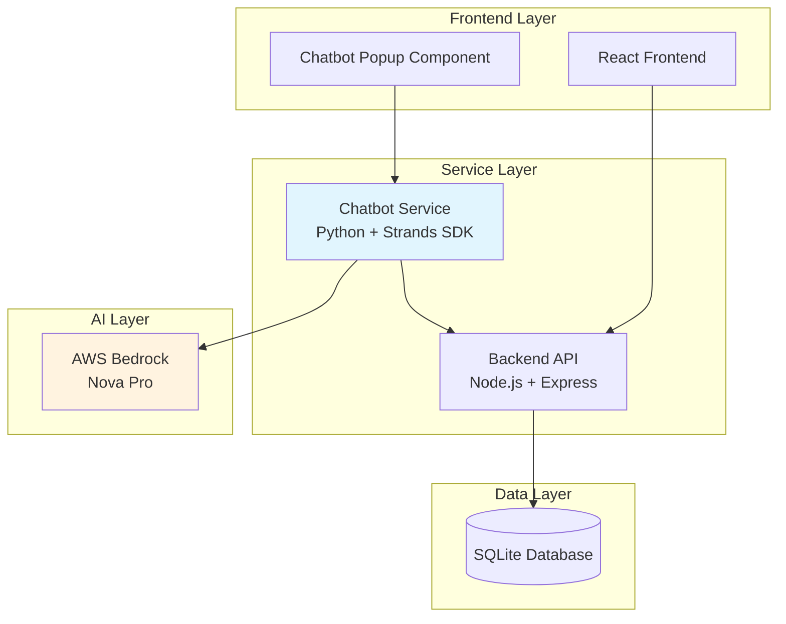

# Design Document

## Overview

The shopping assistant chatbot service is a Python-based microservice that provides intelligent shopping assistance using AWS Bedrock Nova Pro as the underlying language model through the Strands Agents SDK. The service operates independently from the existing Node.js e-commerce backend while integrating seamlessly through HTTP API calls to access product and cart data.

The architecture follows a clean separation of concerns with the chatbot service handling AI interactions and the existing backend managing core e-commerce operations. This design ensures system resilience, independent scalability, and maintainable code organization.

## Architecture

### High-Level Architecture



### Service Communication Flow

1. **Frontend to Chatbot**: React popup component sends user messages to chatbot service via HTTP API
2. **Chatbot Processing**: Strands Agent processes messages using Bedrock Nova Pro and custom tools
3. **Backend Integration**: Chatbot service calls existing backend API endpoints for product/cart operations
4. **Response Generation**: AI-powered responses are returned to frontend with shopping assistance

### Technology Stack

- **AI Framework**: Strands Agents SDK (Python)
- **Language Model**: AWS Bedrock Nova Pro (`us.amazon.nova-pro-v1:0`)
- **HTTP Server**: FastAPI (Python)
- **Backend Integration**: HTTP client (requests/httpx)
- **Environment**: Python 3.10+ with virtual environment
- **Authentication**: AWS credentials via environment variables

## Components and Interfaces

### 1. Chatbot Service Core (`chatbot_service/`)

#### Main Application (`app.py`)
- FastAPI application setup and configuration
- CORS middleware for frontend integration
- Health check endpoints
- Error handling middleware

#### Agent Manager (`agent.py`)
- Strands Agent initialization with Bedrock Nova Pro
- Custom tool registration and management
- Conversation context handling
- Response processing and formatting

#### Backend Integration (`backend_client.py`)
- HTTP client for existing backend API calls
- Product search and retrieval functions
- Cart management operations
- Error handling and retry logic

#### Custom Tools (`tools/`)
- **Product Search Tool**: Search products by name, category, or description
- **Product Details Tool**: Get detailed product information including reviews
- **Cart Management Tool**: Add, update, remove items from cart
- **Cart Summary Tool**: Get current cart contents and total

### 2. HTTP API Layer

#### Chat Endpoint (`/api/chat`)
```python
POST /api/chat
{
    "message": "string",
    "session_id": "string" (optional),
    "context": {} (optional)
}

Response:
{
    "response": "string",
    "session_id": "string",
    "suggestions": ["string"] (optional)
}
```

#### Health Check (`/health`)
```python
GET /health

Response:
{
    "status": "healthy",
    "service": "shopping-assistant-chatbot",
    "timestamp": "ISO-8601"
}
```

### 3. Configuration Management

#### Environment Variables
- `AWS_ACCESS_KEY_ID`: AWS access key for Bedrock authentication
- `AWS_SECRET_ACCESS_KEY`: AWS secret key for Bedrock authentication  
- `AWS_SESSION_TOKEN`: Optional AWS session token
- `AWS_BEARER_TOKEN_BEDROCK`: Alternative Bedrock API key authentication
- `AWS_REGION`: AWS region for Bedrock service (default: us-west-2)
- `BACKEND_API_URL`: Base URL for existing backend API (default: http://localhost:5000)
- `CHATBOT_PORT`: Port for chatbot service (default: 8000)

## Data Models

### Chat Request Model
```python
class ChatRequest(BaseModel):
    message: str
    session_id: Optional[str] = None
    context: Optional[Dict[str, Any]] = None
```

### Chat Response Model
```python
class ChatResponse(BaseModel):
    response: str
    session_id: str
    suggestions: Optional[List[str]] = None
```

### Product Model (from Backend API)
```python
class Product(BaseModel):
    id: int
    name: str
    price: float
    description: str
    emoji: str
    category: str
```

### Cart Item Model (from Backend API)
```python
class CartItem(BaseModel):
    id: int
    product_id: int
    quantity: int
    name: str
    price: float
    emoji: str
```

### Session Context Model
```python
class SessionContext(BaseModel):
    session_id: str
    conversation_history: List[Dict[str, str]]
    user_preferences: Optional[Dict[str, Any]] = None
    last_activity: datetime
```

## Correctness Properties

*A property is a characteristic or behavior that should hold true across all valid executions of a system-essentially, a formal statement about what the system should do. Properties serve as the bridge between human-readable specifications and machine-verifiable correctness guarantees.*

Now I need to complete the prework analysis before writing the correctness properties:

### Property Reflection

After reviewing all properties identified in the prework, I've identified several areas for consolidation:

**Redundancy Analysis:**
- Properties 3.1, 3.2, and 3.3 can be combined into a single comprehensive backend integration property
- Properties 4.1, 4.2, and 4.3 can be consolidated into a comprehensive HTTP API property
- Properties 6.1, 6.2, and 6.3 can be combined into a single product recommendation property
- Authentication properties 2.2, 2.3, and 2.4 are specific examples that can be tested individually
- Service independence properties 5.2 and 5.3 are complementary and should remain separate

**Consolidated Properties:**
The following properties provide unique validation value and will be implemented:

Property 1: Message processing and shopping guidance
*For any* customer message, the Shopping Assistant should process the message and provide relevant shopping guidance
**Validates: Requirements 1.1**

Property 2: Backend API integration for data access
*For any* data request (products, cart, reviews), the system should make appropriate HTTP requests to the Backend API and handle responses correctly
**Validates: Requirements 3.1, 3.2, 3.3**

Property 3: Error handling and user communication
*For any* Backend API failure or system error, the Chatbot Service should handle errors gracefully and provide appropriate user feedback
**Validates: Requirements 3.4, 7.4**

Property 4: HTTP API request handling
*For any* valid chat request, the HTTP Server should accept the request, validate input, and return a properly formatted JSON response
**Validates: Requirements 4.1, 4.2, 4.3**

Property 5: Concurrent request handling
*For any* set of simultaneous requests, the HTTP Server should handle them without conflicts and maintain proper CORS headers
**Validates: Requirements 4.4, 4.5**

Property 6: Service independence
*For any* backend service failure, the Chatbot Service should continue operating independently
**Validates: Requirements 5.2**

Property 7: Product recommendations based on context
*For any* customer query about products, categories, or needs, the Shopping Assistant should provide relevant recommendations using appropriate backend data
**Validates: Requirements 6.1, 6.2, 6.3**

Property 8: Conversation context maintenance
*For any* multi-turn conversation, the Shopping Assistant should maintain context and provide consistent, contextually-aware responses
**Validates: Requirements 6.5**

Property 9: Configuration management
*For any* required configuration (AWS credentials, backend URL, ports), the system should use environment variables appropriately and fail gracefully when misconfigured
**Validates: Requirements 7.5**

## Error Handling

### Error Categories and Responses

#### 1. Authentication Errors
- **AWS Credential Issues**: Log detailed error, return 503 Service Unavailable
- **Bedrock Access Denied**: Log permission error, return 503 Service Unavailable
- **Token Expiration**: Log expiration, attempt refresh, return 503 if failed

#### 2. Backend API Errors
- **Connection Timeout**: Retry with exponential backoff, inform user of temporary issues
- **404 Not Found**: Return helpful message about product/cart not existing
- **500 Server Error**: Log error, inform user of temporary backend issues
- **Rate Limiting**: Implement backoff, queue requests, inform user of delays

#### 3. Input Validation Errors
- **Invalid JSON**: Return 400 Bad Request with clear error message
- **Missing Required Fields**: Return 400 Bad Request specifying missing fields
- **Invalid Session ID**: Create new session, continue processing
- **Malformed Requests**: Return 400 Bad Request with validation details

#### 4. AI Model Errors
- **Bedrock Service Unavailable**: Log error, return fallback response
- **Token Limit Exceeded**: Truncate context, retry with shorter input
- **Model Timeout**: Log timeout, return apologetic message with retry suggestion
- **Invalid Model Response**: Log response, return generic helpful message

### Error Response Format
```python
{
    "error": {
        "code": "string",
        "message": "string",
        "details": "string" (optional),
        "retry_after": int (optional)
    },
    "session_id": "string"
}
```

## Testing Strategy

### Dual Testing Approach

The testing strategy employs both unit testing and property-based testing to ensure comprehensive coverage:

**Unit Tests:**
- Verify specific examples and edge cases
- Test integration points between components
- Validate error handling scenarios
- Test authentication flows with known credentials
- Verify API endpoint responses with sample data

**Property-Based Tests:**
- Verify universal properties across all inputs using Hypothesis (Python property-based testing library)
- Each property-based test will run a minimum of 100 iterations
- Tests will be tagged with comments referencing design document properties
- Format: `**Feature: shopping-assistant-chatbot, Property {number}: {property_text}**`

**Property-Based Testing Library:** Hypothesis for Python
- Minimum 100 iterations per property test
- Smart generators for realistic test data (products, messages, API responses)
- Shrinking capabilities to find minimal failing examples

**Testing Requirements:**
- Each correctness property must be implemented by a single property-based test
- Property-based tests must be tagged with explicit references to design document properties
- Unit tests complement property tests by covering specific examples and integration scenarios
- Both test types are essential for comprehensive validation

### Test Data Generation

**Smart Generators:**
- Product data generator: realistic names, prices, categories, descriptions
- Message generator: various shopping queries, product requests, cart operations
- API response generator: valid and invalid backend responses
- Session context generator: conversation histories, user preferences
- Error condition generator: network failures, invalid credentials, malformed data

### Integration Testing

**Backend API Integration:**
- Mock backend server for testing API interactions
- Test all CRUD operations on products and cart
- Verify error handling for various backend failure scenarios
- Test timeout and retry mechanisms

**AWS Bedrock Integration:**
- Mock Bedrock responses for testing AI interactions
- Test authentication with various credential configurations
- Verify error handling for Bedrock service issues
- Test token limit and timeout scenarios

## Deployment Architecture

### Service Configuration

**Port Allocation:**
- Chatbot Service: Port 8000 (configurable via CHATBOT_PORT)
- Backend API: Port 5000 (existing)
- Frontend: Port 3000 (existing)

**Process Management:**
- Independent Python process for chatbot service
- Separate from Node.js backend process
- Health check endpoints for monitoring
- Graceful shutdown handling

### Environment Setup

**Python Environment:**
```bash
# Create virtual environment
python -m venv .venv
source .venv/bin/activate  # Linux/macOS
# .venv\Scripts\activate.bat  # Windows

# Install dependencies
pip install strands-agents strands-agents-tools fastapi uvicorn httpx
```

**AWS Configuration:**
```bash
# Option 1: AWS Credentials
export AWS_ACCESS_KEY_ID=your_access_key
export AWS_SECRET_ACCESS_KEY=your_secret_key
export AWS_SESSION_TOKEN=your_session_token  # Optional
export AWS_REGION=us-west-2

# Option 2: Bedrock API Key
export AWS_BEARER_TOKEN_BEDROCK=your_bedrock_api_key
```

**Service Configuration:**
```bash
export BACKEND_API_URL=http://localhost:5000
export CHATBOT_PORT=8000
```

### Monitoring and Observability

**Health Checks:**
- `/health` endpoint for service status
- Backend API connectivity checks
- AWS Bedrock authentication status
- Memory and performance metrics

**Logging:**
- Structured JSON logging
- Request/response logging with sanitized data
- Error tracking with stack traces
- Performance metrics (response times, token usage)

**Metrics:**
- Request count and response times
- Backend API call success/failure rates
- Bedrock token usage and costs
- Error rates by category
- Concurrent user sessions